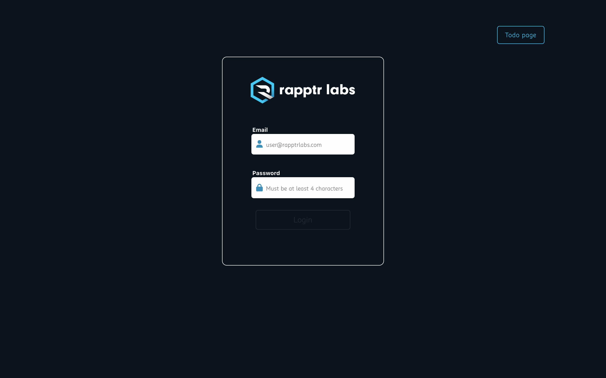
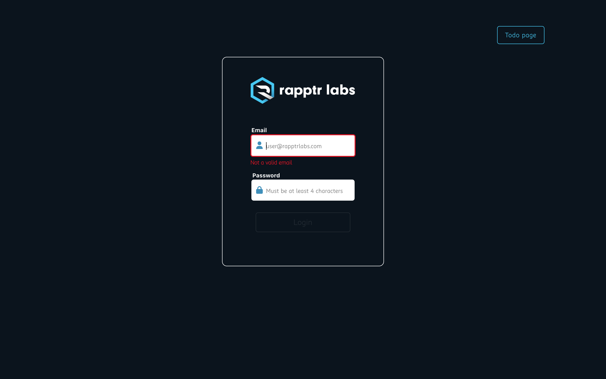
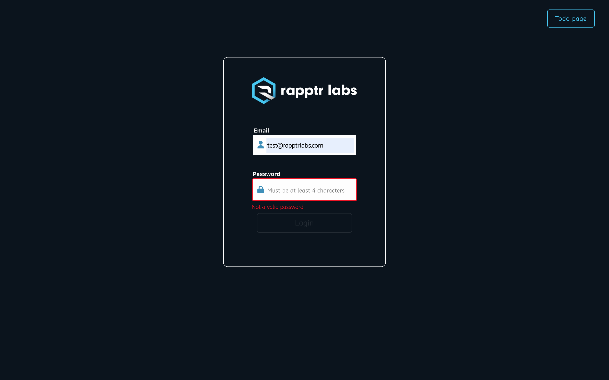
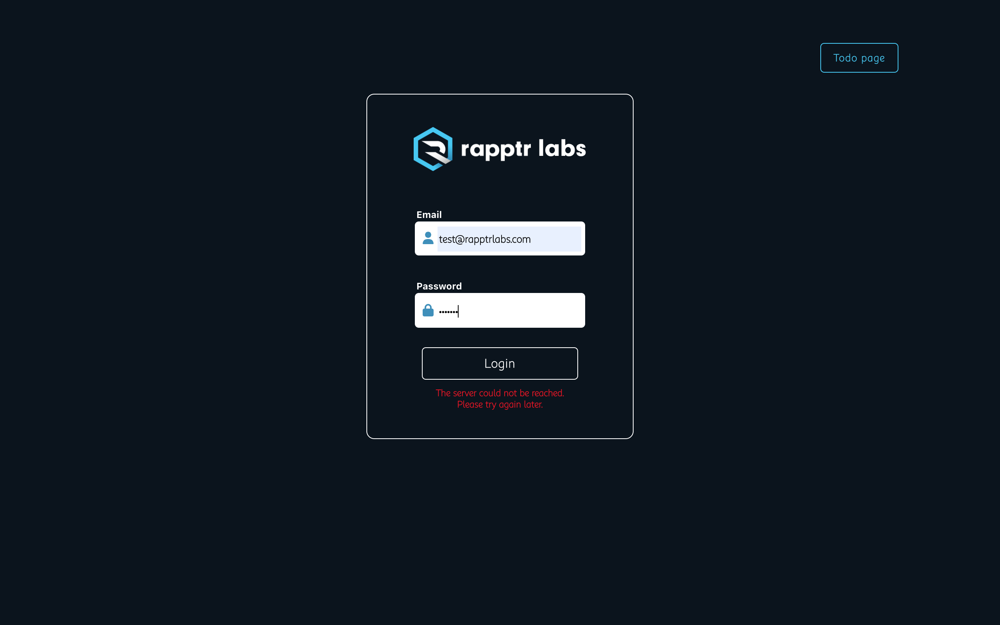
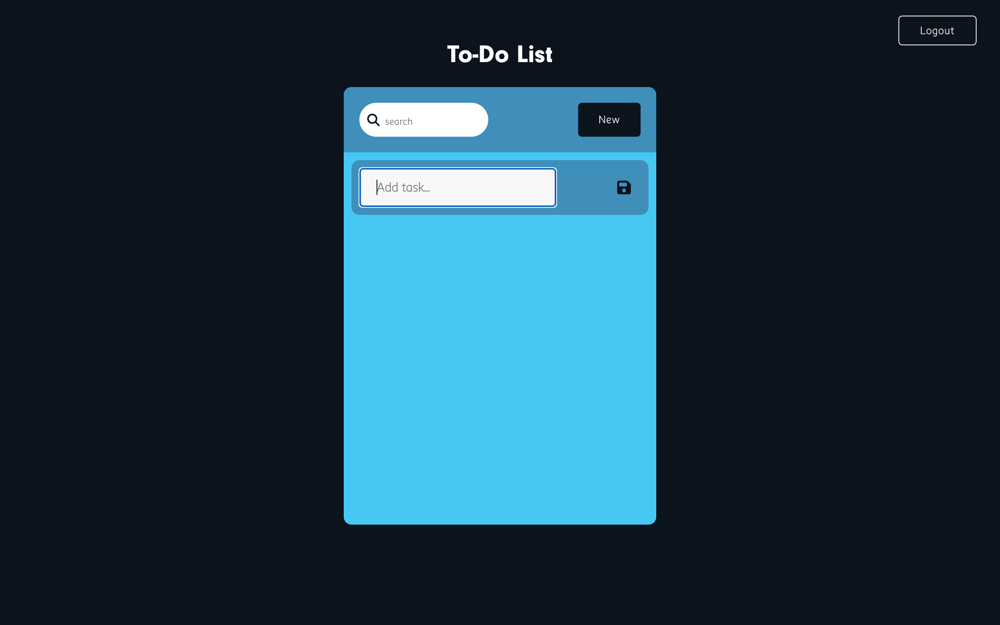
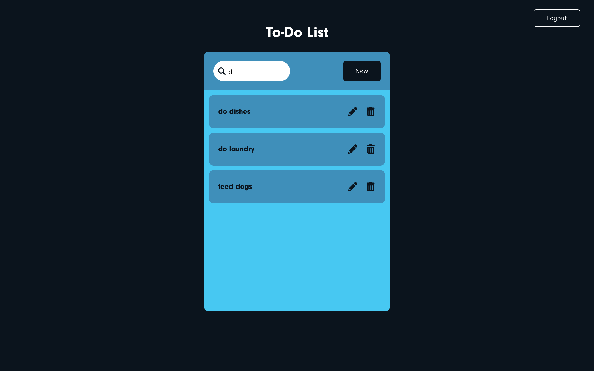
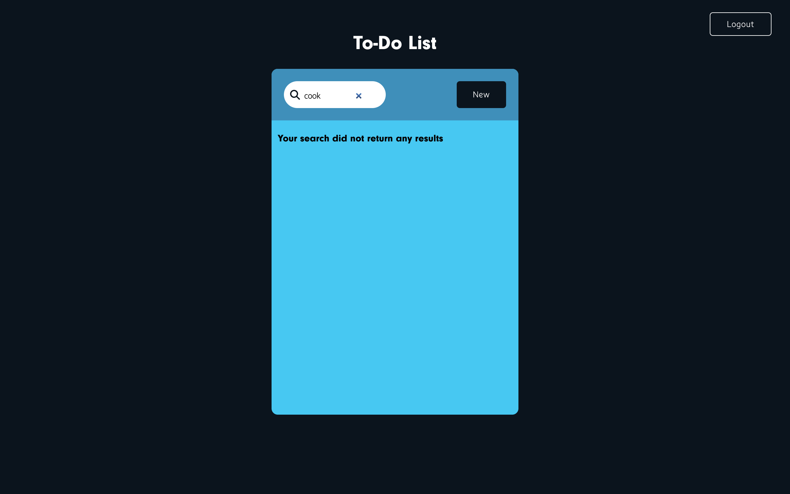

# Login & ToDo List
  [](https://opensource.org/licenses/MIT)
  
  ## Deployment
  
  https://gnartistic.github.io/this/  

  
  
  
  
  
  
  
  


  ## Description
  
  This is a react app I created to demonstrate my knowledge of functional components, hooks, and state, as well as my ability to create and style an application using CSS and JSX. I used various npm packages for styling such as sass, animate.css, and fortawesome. I implemented Axios.js for the api request, but was unfortunately unsuccessful. I enjoyed this project, I learned quite a bit while building it. The biggest challenges I faced while developing this app were the API request for the login, and the search bar functionality in the todo list. I spent the first day building and styling the login component, then moved on to the input validation and functionality. After spending another day struggling to get a successful response from the server, I pivoted to the todo list and began building and styling that component. I spent most of my time contemplating the logic and researching the functionality of the search bar. I split it up into 3 parts, the parent component, and two child components. Overall, I am very pleased with what I was able to achieve, and I'm grateful to have had the opportunity to grow just a lil bit more as a developer through this project.
  
  ## Table of Contents
  
  [Installation Instructions](#installation-instructions)  
  [Usage Information](#usage-information)  
  [Contribution Guidelines](#contribution-guidelines)  
  [Test Instructions](#test-instructions)  
  [Questions](#questions)  
  
  ## Installation-Instructions
  
  If you wish to run this application from your local machine, after cloning this repository, run the following code in the terminal at the root of the application:
  ```npm install```
  
  ## Usage-Information
  
  After the npm packages have been installed, run the following code in the terminal at the root of the application:
  ```npm start```
  
  ## License
  
  MIT License
  
  ## Contribution-Guidelines
  
  I am not accepting project contributions at this time.
  
  ## Test-Instructions
  
  If you wish to test out the app, please visit the deployed link at the top of this readme.
  
  ## Questions
  
  GitHub Username: [@gnartistic](https://github.com/gnartistic)  
  
  Please feel free to reach out to me at [gn4rtistic@gmail.com](mailto:gn4rtistic@gmail.com) for questions

